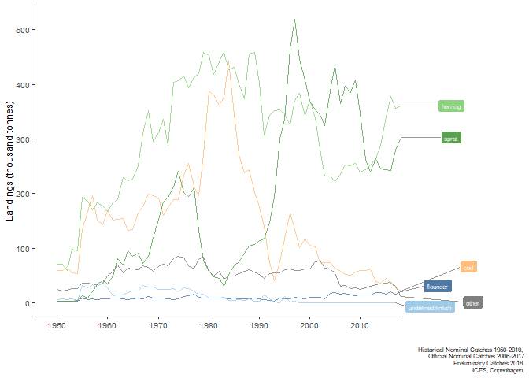

[](https://travis-ci.org/ices-tools-prod/icesFO)
[](https://cran.r-project.org/package=icesFO)
[](https://cran.r-project.org/package=icesFO)
[](https://cran.r-project.org/package=icesFO)

[](http://ices.dk)

# icesFO

icesFO Functions to support the creation of ICES Fisheries Overviews, ….

icesFO is implemented as an [R](https://www.r-project.org) package
<!-- and available on [CRAN](https://cran.r-project.org/package=icesFO). -->
and available on GitHub

## Installation

icesFO can be installed from GitHub using the `install_github` command
from the `devtools` package:

``` r
library(devtools)
install_github("ices-tools-prod/icesFO")
```

## Usage

For a summary of the package:

``` r
library(icesFO)
?icesFO
```

## Development

icesFO is developed openly on
[GitHub](https://github.com/ices-tools-prod/icesFO).

Feel free to open an
[issue](https://github.com/ices-tools-prod/icesFO/issues) there if you
encounter problems or have suggestions for future versions.

The current development version can be installed using:

``` r
library(devtools)
install_github("ices-tools-prod/icesFO@devel")
```

## Examples

## Plot ICES official catch statistics

In this example, the plots for ICES official catch statistics for the
Baltic Sea Ecoregion are made. First the data is downloaded and formated

``` r
library(icesFO)

# download data
hist <- load_historical_catches()
official <- load_official_catches()
prelim <- load_preliminary_catches(2018)

# format / process
catch_dat <- format_catches(2018, "Baltic Sea Ecoregion", hist, official, prelim)
```

    ## Joining, by = "X3A_CODE"

``` r
# plot
p <- plot_catch_trends(catch_dat, type = "COMMON_NAME", line_count = 5, plot_type = "line")
p
```

<!-- -->
