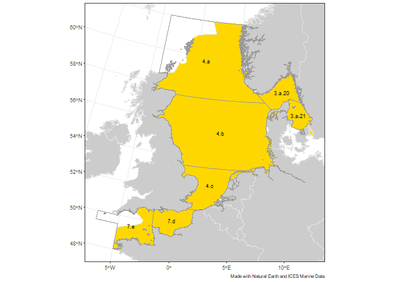
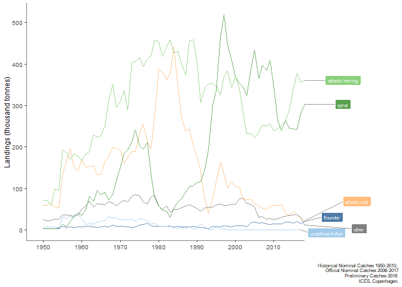
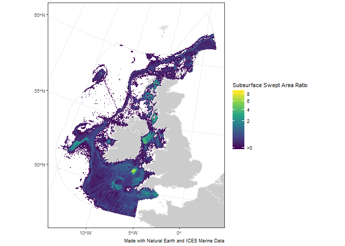
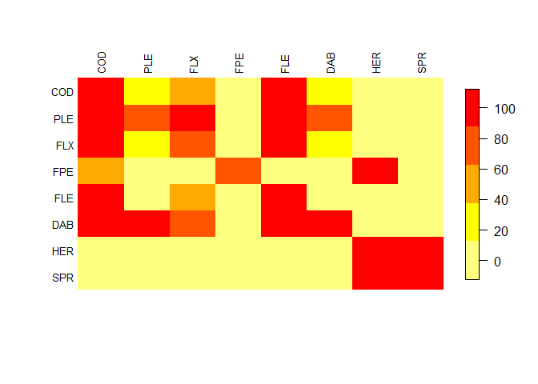

[](https://travis-ci.org/ices-tools-prod/icesFO)
[](https://cran.r-project.org/package=icesFO)
[](https://cran.r-project.org/package=icesFO)
[](https://cran.r-project.org/package=icesFO)

[](http://ices.dk)

# icesFO

icesFO Functions to support the creation of ICES Fisheries Overviews, ….

icesFO is implemented as an [R](https://www.r-project.org) package
<!-- and available on [CRAN](https://cran.r-project.org/package=icesFO). -->
and available on GitHub

## Installation

icesFO can be installed from GitHub using the `install_github` command
from the `devtools` package:

``` r
library(devtools)
install_github("ices-tools-prod/icesFO")
```

## Usage

For a summary of the package:

``` r
library(icesFO)
?icesFO
```

## Development

icesFO is developed openly on
[GitHub](https://github.com/ices-tools-prod/icesFO).

Feel free to open an
[issue](https://github.com/ices-tools-prod/icesFO/issues) there if you
encounter problems or have suggestions for future versions.

The current development version can be installed using:

``` r
library(devtools)
install_github("ices-tools-prod/icesFO@devel")
```

## Examples

## Plot ecoregion map

In this example the map of the Greater North Sea ecoregion is plotted

see

``` r
?icesFO::plot_ecoregion_map
```

for more details

first download the ices area shape and the ecoregion shape. Both are
converted to sf polygons for easy plotting

``` r
library(icesFO)

# download data
ices_areas_nrs <- load_areas("Greater North Sea")
ecoregion_nrs <- load_ecoregion("Greater North Sea")
```

then the plot can be made:

``` r
# plot
eco_map <- plot_ecoregion_map(ecoregion_nrs, ices_areas_nrs)
```

    ## Warning in st_centroid.sf(ices_areas): st_centroid assumes attributes are
    ## constant over geometries of x

``` r
eco_map
```

<!-- -->

## Plot ICES official catch statistics

In this example, the plots for ICES official catch statistics for the
Baltic Sea Ecoregion are made. First the data is downloaded and formated

see

``` r
?icesFO::plot_catch_trends
```

for more details

``` r
library(icesFO)

# download data
hist <- load_historical_catches()
official <- load_official_catches()
prelim <- load_preliminary_catches(2018)

# format / process
catch_dat <- format_catches(2018, "Baltic Sea Ecoregion", hist, official, prelim)
```

    ## Joining, by = "X3A_CODE"

then the plot can be made:

``` r
# plot
p <- 
  plot_catch_trends(catch_dat, type = "COMMON_NAME", 
                    line_count = 5, plot_type = "line")
p
```

<!-- -->

## Plot surface swept area ratio plot

In this example the map of the average swept area ration for the Celtic
Sea ecoregion is plotted

see

``` r
?icesFO::plot_sar_map
```

for more details

first download the ICES ecoregion shape. Both are converted to sf
polygons for easy plotting

``` r
library(icesFO)

# download data
ecoregion_cs <- load_ecoregion("Celtic Seas")
```

Then dowload the SAR data using the icesVMS package.

<div class="alert alert-danger"
  <strong>NOTE:</strong> Only users with permission to access aggregated VMS data
  can use this service.
</div>

``` r
remotes::install_github("ices-tools-prod/icesVMS")
```

    ## Skipping install of 'icesVMS' from a github remote, the SHA1 (8f2fd475) has not changed since last install.
    ##   Use `force = TRUE` to force installation

``` r
library(icesVMS)

# download data
sar <- icesVMS::get_sar_map("Celtic Seas")
```

    ## status code: 200

``` r
# convert to sf
sar$wkt <- sf::st_as_sfc(sar$wkt)
sar <- sf::st_sf(sar, sf_column_name = "wkt", crs = 4326)
```

then the plot can be made:

``` r
# plot
sar_map <- plot_sar_map(sar, ecoregion_cs, what = "subsurface")
sar_map
```

<!-- -->

## Plot technical interactions

In this example, the plots of technical interactions between gears are
shown

see

``` r
?icesFO::compute_technical_interactions
```

for more details

First we get the STECF landings data from the [Baltic Sea Fishery
overview
repository](https://github.com/ices-taf/2019_BtS_FisheriesOverview).

``` r
library(icesTAF)

repoUrl <- 
  sprintf("https://raw.githubusercontent.com/ices-taf/%s/master/",
          "2019_BtS_FisheriesOverview")

STECF_landings <-
  read.taf(file.path(repoUrl, "bootstrap/initial/data/STECF_landings.csv"), 
    fileEncoding = "UTF-8-BOM", check.names = TRUE)
```

then the calculation and plot can be made:

``` r
technical_interacton <- 
  compute_technical_interactions(STECF_landings, catchCoverage = 0.99)
```

``` r
plot_technical_interactions(technical_interacton$recapLand)
```

<!-- -->
